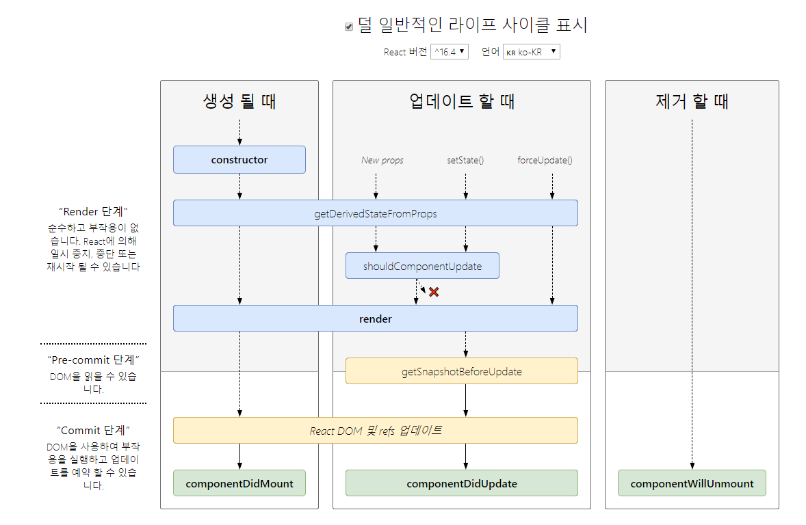

# React Movie Info Website

[Go to website](https://euijunh.github.io/react-movie-web/)

- arrow function
```javascript
  > data => data;
  > (a, b) => {return a + b;}
```
- Template Literals
```javascript
  > "hi" + name -> `hi ${name}`
```

- Object Destructuring
```javascript
  const human = {
    name: 'jun',
    lastName: 'uu',
    food: {
      lunch: 'soup',
      dinner: 'steak'
    }
  }
  
  // const name = human.name;
  // const nameLast = human.lastName;
  // const dinner = human.food.dinner;
  
  const {
    name, 
    lastName: nameLast,
    food: {lunch, dinner}
  } = human;
  
  console.log(name, nameLast, dinner);
```

- spread operator
```javascript
  const days = ['mon', 'tues', 'wed'];
  const days2 = ['thu', 'fri', 'sat'];
  
  // const allDays = [days, days2];
  
  const allDays = [...days, ...days2, 'sun'];
  
  console.log(allDays);
  
  const ob = {
    a: 1,
    b: 2
  };
  
  const ob2 = {
    c: 3,
    d: 4
  };
  
  // const allOb = {ob, ob2};
  
  const allOb = {...ob, ...ob2};
  
  console.log(allOb);
```

- Classes
```javascript
  class Human {
    constructor(name, lastName) {
      this.name = name;
      this.lastName = lastName;
    }
  }
  
  const alex = new Human('alex', 'don');
  
  console.log(alex);
  
  class Baby extends Human {
    cry() {
      console.log('uuuuuuuuuuuu');
    }
  }
  
  const baby2 = new Baby('alex', 'don');
  
  console.log(Baby.cry());
```

- Array.map
```javascript
  const days = ['mon', 'tues', 'wed', 'thu', 'fri', 'sat'];
  
  const allDays = days.map((data, index) => `${data} ${index}up`);
  
  console.log(allDays);
```

- Array.filter
```javascript
  const numbers = [32,432,5,5,43,1,3,21,,53,2,532,1,23,321,31];
  
  const numberFilter = numbers.filter(number => number > 50);
  
  console.log(numberFilter);
```

- .forEach .includes .push
```javascript
  const arr = ['hi', 'bye', 'you'];
  
  arr.forEach(number => console.log(number));
  
  arr.push(100);
  
  if(arr.includes('hi')) {
    console.log('hi가 있다.');
  } else {
    console.log('hi가 없다.');
  }
```

** React **

페이스북에서 제공하는 컴포넌트 기반 프론트엔드 라이브러리

*컴포넌트*

        리액트는 컴포넌트 기반의 라이브러리이다.
        
        UI는 여러개의 컴포넌트로 이루어져 있다.
        
        작게 쪼개서 개발해 유지보수하기 편하고 재사용을 높힐 수 있다.
        
        클래스형(stateful) : state가 있다.
        
        함수형(stateless) :  state가 없다. 라이프사이클 X

*단방향 데이터 흐름 one Way data flow*

        데이터가 한 방향으로만 흐른다.
        
        부모가 자식에게 데이터를 줄 수만 있고 자식이 부모에게 데이터를 줄 수 없다.
        
        그래서 부모의 데이터를 바꿔주기 위해서는 state를 사용해야 한다.

*props*

        부모 컴포넌트에서 자식 컴포넌트로 전달해 주는 데이터
        
        읽기 전용 데이터로 전달 받은 props를 자식 컴포넌트에서 변경이 불가능하고 
        
        props를 전달해준 최상위 부모 컴포넌트만 props를 변경할 수 있다.

*state*

        동적인 데이터를 다룰 때 사용

        사용자와의 상호작용을 통해 데이터를 동적으로 변경을 해야할 때 사용

        클래스형 컴포넌트에서만 사용할 수 있으며 각각의 state는 

        독립적이라 다른 컴포넌트의 직접적인 접근은 불가능하다.

        그러나 자신보다 상위에 있는 state는 변경이 가능한데 

        state를 변경해주는 함수를 props로 받는다면 state의 변경이 가능하다.

        props로 넘겨줄 때에 this의 binding을 주의해야한다.

*Virtual DOM*

        가상의 Document Object Model

        웹 브라우저에서 html 파일을 열게되면, html코드들이 DOM을 만드는데
        
        만약 html 코드의 특정 한 부분이 변경되게 된다면 전체 DOM을 새롭게 만들게 되어 비효율적인 구조이다.

        React는 가상의 DOM을 만들어서 진짜 DOM과 비교하여 변경 사항이 있을 경우 전체를 새롭게 만드는게 아니라
        
        변경된 부분만 진짜 DOM의 반영하는 방식으로 작업을 수행해서 효율성과 속도가 높아진다.


## Container Presenter Pattern
Container Presenter Pattern에서 컨테이너는 data, state(상태값)을 가지고 api를 불러온다.

그리고 로직을 처리한다. 그 다음에 프리젠터는 그 데이터들을 보여주는 역할

프리젠터는 state(상태값)을 가지고 있지 않고 api가 먼지 모르고 클래스도 없고 그냥 함수형 컴포넌트이다.

### Container Presenter Pattern - Container
- 라이프사이클 (클래스)

       처음 render시에 : constructor -> render -> ref -> componentDidMount

       setState/props 바뀔 때 : shouldComponentUpdate(return true일 때) -> render -> componentDidUpdate

       부모가 자신을 없애면 : componentWillUnmount - 소멸
       
  {:.aligncenter}

- Header는 Route가 아니기 때문에 Router에서 location 정보를 받을 수 없다.

- history.push()

  라우터에 새 URL을 푸시하는 데 사용됩니다.

  Route는 컴포넌트에 기본적으로 match, history, location 이라는 것을 넘겨준다. 
  
  이때 histroy.push(‘/인자’) 함수에 인자를 넣어주면 해당 인자로 url을 새로고침 없이 이동시켜준다.

- Destructuring assignment with let -> ({ latitude, longitude } = props.userLocation.coords);

    Destructuring은 let, const또는 var선언 뒤에 있거나 블록 문과 구별하기 위해 식 컨텍스트에 있어야합니다.

### Container Presenter Pattern - Presenter
```javascript
- propTypes (isRequired = 필수값)
  내가 전달받은 props가 내가 원하는 props인지 확인해준다

'key'는 목록에 렌더링 된 많은 컴포넌트가있을 때 React에서 필요한 특성이며, 단지 요구 사항이며 표시에 영향을 미치지 않습니다.

시각장애인들에게 필요한 screen reader에서 screen을 읽으려 하면 aria-label 속성을 알려준다.

event.preventDefault()

JSX, {children}, props, state

- react-helmet

body태그가 아닌 head 태그를 수정
```

```javascript
<Router>
    <>
      <Route path="/" exact component={Home} />
      <Route path="/tv" exact component={TV} />
      <Route path="/search" exact component={Search} />
    </>
</Router>
// path: 어느 URL에서 해당 Route를 render를 할 지
// exact: 정확히 해당 패스여야 한다는 걸 알려준다 - exact를 사용하지않을시 /tv와 /tv/popular이 서로 매칭된다.
// component: Route에 왔을 때 어떤 컴포넌트가 보여질 건지에 대한거야

Fragments( <></> )
// 리액트는 두 개의 컴포넌트를 리턴할 수 없고 Router는 오직 하나의 child만 가질 수 있는데 두개 이상 가질 수 있게 하는 방법

// Hash Router(페이지의 Hash를 사용)
// URL에 #이 포함된다. 구현이 쉽지만 #때문에 웹사이트보다는 앱에 있다는 느낌을 줄 수 있다.
// BrowserRouter( HTML history API 사용 )
// 일반적인 페이지처럼 동작한다. 

<Route path="/tv/popular" render={() => <h1>popular</h1>} />
// React Router에 있는 Composition은 두 개 이상의 Route를 랜더링하는 방식
// 뒤에 component를 쓰는 대신 render를 사용할 수 있다( function이 들어감 )

// URL의 앞부분이 같아서 문제 두개의 랜더 되는 문제
// 이 부분을 고치기 위해 Switch를 사용 <Switch>
// Switch는 한 번에 오직 하나의 Route만 Render하게 해줌
// Redirect 추가

// styled-components
// a태그 대신에 React Router에서 주어진 Link
// 이 링크는 해당 페이지가 내 어플리케이션에 있으면
// 그 곳으로 브라우저한 방식으로 가지 않고 JS의 방식으로 가게 해준다.

// styled-reset
// css를 초기화해서 0의 상태에서 시작하게 하는 것

// withRouter
// 다른 컴포넌트를 감싸는 컴포넌트 
// Router에 props를 전달, 덕분에 다른 컴포넌트와도 연결할 수 있고 Header가 우리가 어디 있는지 알 수 있다.


//  axios: request랑 작업하기 좋다.
```
